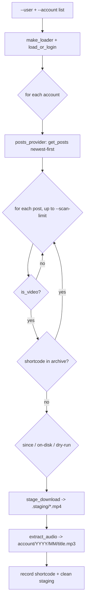

# Instagram Audio Downloader — Architecture & Code Walkthrough

A deep-dive into `transcription/tools/fetch_instagram.py` and the shared
`transcription/tools/_media_common.py`: what they do, why they are built this
way, every library choice, and a line-by-line explanation of the code. This is
the Instagram counterpart of [`YOUTUBE_DOWNLOADER.md`](YOUTUBE_DOWNLOADER.md) and
shares its design and on-disk layout.

---

## 1. What the tool does

Given one or more Instagram **accounts**, the tool:

1. Logs in once and reuses a saved **session** (Instagram blocks/rate-limits
   almost everything anonymously).
2. Walks each profile's posts, newest first, **bounded** by `--scan-limit`.
3. Keeps only **videos** (video posts + reels).
4. Skips anything already downloaded — a **download archive** (source of truth)
   *and* an on-disk check (safety net).
5. Downloads each video to a **staging** dir, then **extracts audio with ffmpeg**.
6. Writes the result to:

   ```
   {out}/{account}/{year}/{month}/{title}.{ext}
   ```

   - `{account}` — the Instagram username.
   - `{year}/{month}` — the post's **upload** month in UTC (not the download date).
   - `{title}` — sanitized first line of the caption, falling back to the post
     **shortcode**.
   - `{ext}` — the audio codec (default `mp3`).

The layout is identical to `fetch_youtube.py`'s, so downstream transcription
treats YouTube and Instagram audio the same way.

### Example commands

```bash
# one-time login (prompts password, then 2FA if enabled); saves a session
python transcription/tools/fetch_instagram.py --user YOUR_LOGIN --login

# fetch new videos from one or more accounts (reuses the saved session)
python transcription/tools/fetch_instagram.py --user YOUR_LOGIN \
    --account natgeo --account 2m.ma

# preview without downloading
python transcription/tools/fetch_instagram.py --user YOUR_LOGIN --account natgeo --dry-run

# bound a first run, only 2026 onward, tee a timestamped log
python transcription/tools/fetch_instagram.py --user YOUR_LOGIN --account natgeo \
    --max-downloads 10 --since 20260101 --log instagram/fetch.log
```

---

## 2. Where it fits + the shared module

This repo is a Darija transcription pipeline; media is organised as
`{account}/{year}/{month}/…` and fed to the transcription CLI. `fetch_youtube.py`
and `fetch_instagram.py` are **ingestion** tools that sit in front of it.

Because the two tools must produce byte-identical layouts and behave the same way
for filenames, timestamps, archives and logging, the genuinely generic helpers
live in one place — **`tools/_media_common.py`** — and both tools import them:

```
            _media_common.py  (pure, shared, unit-tested)
           /                 \
fetch_youtube.py            fetch_instagram.py
   (yt-dlp)                    (instaloader)
```

`fetch_youtube.py` was refactored to import these helpers (its 65 tests stayed
green); `fetch_instagram.py` imports the same set.

---

## 3. Architecture

### 3.1 Two halves: pure core + injected I/O

| Half | Symbols | Property |
|------|---------|----------|
| **Pure core** (shared) | `slugify_channel`, `sanitize_filename`, `stamp_from_datetime`, `dest_for`, `load_archive`, `append_archive`, `make_logger` | No network, deterministic, fully tested. |
| **Pure core** (Instagram) | `caption_title`, `stamp_from_post`, `archive_key`, `instagram_dest_path`, `ffmpeg_extract_cmd`, `InstaConfig`, `RunStats` | Pure; operate on plain post objects. |
| **I/O** | `make_loader`, `load_or_login`, `_default_posts_provider`, `stage_download`, `extract_audio`, `download_account`, `download_all`, `main` | Talk to instaloader / ffmpeg / disk. |

The key idea (same as the YouTube tool) is **dependency injection**: the loop
receives a `posts_provider` and an `extract` callable, so the whole thing is
tested with fakes — no instaloader, no network, no ffmpeg.

### 3.2 The pipeline



### 3.3 Deduplication (archive + filesystem)
Same two mechanisms as the YouTube tool:
1. **`instagram/.download-archive.txt`** — one line per post, `instagram <shortcode>`.
2. **On-disk check** — if the target mp3 exists but the archive missed it,
   backfill the archive and skip. Re-runs are idempotent; the archive self-heals.

### 3.4 Hybrid staging → ffmpeg
instaloader downloads the **video** into `instagram/.staging/`, then ffmpeg
extracts the audio into the final tree. `make_loader` disables thumbnails,
metadata JSON and caption txt so only the mp4 is staged; `_cleanup_staging`
removes staged files afterward (in a `finally`, so failures leave no junk).

### 3.5 Authentication
`--login` performs an interactive login (password via `getpass`, plus 2FA if
Instagram asks) and saves a session file; normal runs load it. The session file
is a credential and lives under the gitignored `instagram/` tree.

---

## 4. Library choices

### 4.1 `instaloader`
- Purpose-built, actively maintained, pure-Python. Handles session login (incl.
  2FA), profile iteration, downloads with correct headers, and **rate-limit
  backoff** — the parts that are painful to do by hand against Instagram.
- API used (v4.15.1, verified against the docs): the `Instaloader(...)`
  constructor options, `login()`/`two_factor_login()`/`save_session_to_file()`/
  `load_session_from_file()`, `Profile.from_username(L.context, name).get_posts()`,
  and `download_post(post, target)`. Post fields `.is_video`, `.shortcode`,
  `.date_utc` (naive UTC), `.caption`.
- Used as a **library** (not the CLI) for structured `Post` objects and easy
  mocking.

### 4.2 `ffmpeg`
A system binary (already a project dependency), invoked directly for the
staged-mp4 → mp3 step. Not a pip package.

### 4.3 Standard library only otherwise
`argparse` (CLI), `getpass` (password prompt), `subprocess` (ffmpeg),
`dataclasses`, `datetime`, `re`, `pathlib`, `typing`.

---

## 5. Line-by-line walkthrough

### 5.1 `_media_common.py` (shared helpers)

```python
_ILLEGAL_FS = re.compile(r'[\\/:*?"<>|\x00-\x1f]')
DEFAULT_SCAN_LIMIT = 50
```
- `_ILLEGAL_FS` matches characters illegal in filenames on common filesystems
  (Windows strictest) plus ASCII control chars; everything else (incl. Arabic,
  emoji) is preserved.
- `DEFAULT_SCAN_LIMIT` — default per-account/channel scan window, shared by both
  tools.

```python
def slugify_channel(title, fallback="unknown-channel"):
    if not title:
        return fallback
    cleaned = _ILLEGAL_FS.sub("", title)
    cleaned = re.sub(r"\s+", " ", cleaned).strip()
    cleaned = cleaned.strip(". ")
    return cleaned or fallback
```
- Turns an account/channel name into one safe path segment: strip illegal chars,
  collapse whitespace, trim trailing dots/spaces (invalid on Windows), fall back
  if it empties out.

```python
def sanitize_filename(name, max_len=150, fallback="video"):
    if not name:
        return fallback
    cleaned = _ILLEGAL_FS.sub("", name)
    cleaned = re.sub(r"\s+", " ", cleaned).strip().strip(". ")
    if len(cleaned) > max_len:
        cleaned = cleaned[:max_len].rstrip(". ")
    return cleaned or fallback
```
- Same rules as `slugify_channel`, plus a length cap (stay well under the
  255-byte filesystem limit). Used for the filename stem.

```python
def stamp_from_datetime(d):
    if d.tzinfo is not None:
        d = d.astimezone(dt.timezone.utc)
    return d.strftime("%Y%m%d%H%M%S")
```
- Formats any datetime as a 14-digit UTC `YYYYMMDDHHMMSS` stamp. Aware datetimes
  are converted to UTC; naive ones are assumed UTC (instaloader's `date_utc` is
  naive UTC, YouTube's epoch is converted to aware UTC before calling this). This
  is what guarantees both tools stamp identically.

```python
def dest_for(out_root, account, stamp, title, ext):
    year, month = stamp[:4], stamp[4:6]
    return Path(out_root) / account / year / month / f"{title}.{ext.lstrip('.')}"
```
- The shared path builder: `out/{account}/{YYYY}/{MM}/{title}.{ext}`. `title` is
  pre-sanitised by the caller; `ext.lstrip('.')` tolerates `"mp3"` or `".mp3"`.

```python
def load_archive(archive_path):
    if not archive_path.exists():
        return set()
    lines = archive_path.read_text(encoding="utf-8").splitlines()
    return {ln.strip() for ln in lines if ln.strip()}

def append_archive(archive_path, key):
    archive_path.parent.mkdir(parents=True, exist_ok=True)
    with archive_path.open("a", encoding="utf-8") as fh:
        fh.write(key + "\n")
```
- Archive as a `set` (O(1) membership); missing file → empty set; append mode is
  crash-safe and cheap. Lines look like `instagram <shortcode>` or
  `youtube <id>`.

```python
def make_logger(log_path):
    fh = None
    if log_path is not None:
        log_path.parent.mkdir(parents=True, exist_ok=True)
        fh = log_path.open("a", encoding="utf-8")
    def emit(msg):
        print(msg)
        if fh is not None:
            ts = dt.datetime.now().strftime("%Y-%m-%d %H:%M:%S")
            fh.write(f"{ts} {msg}\n"); fh.flush()
    def close():
        if fh is not None:
            fh.close()
    return emit, close
```
- The tee logger: `emit` prints to stdout (clean) and, with `--log`, appends a
  timestamped line (flushed, so `tail -f` works). `close()` is a no-op without a
  file.

### 5.2 `fetch_instagram.py`

#### Module docstring & imports
```python
from _media_common import (
    DEFAULT_SCAN_LIMIT, append_archive, dest_for, load_archive,
    make_logger, sanitize_filename, stamp_from_datetime,
)
```
- The shared helpers are imported by name (the `tools/` dir is on `sys.path`
  whether run as a script or imported in tests). `instaloader` is **not**
  imported at top — only lazily in `main`, so the module imports without it.

```python
_CODECS = {"mp3": "libmp3lame", "m4a": "aac", "aac": "aac",
           "opus": "libopus", "ogg": "libvorbis", "wav": "pcm_s16le", "flac": "flac"}
```
- Maps an output format to the ffmpeg encoder.

#### Pure helpers
```python
def caption_title(post):
    cap = getattr(post, "caption", None)
    if not cap:
        return None
    for line in cap.splitlines():
        line = line.strip()
        if line:
            return line
    return None
```
- Instagram posts have **captions, not titles** — the analog of a YouTube title
  is the caption's first non-empty line. Returns `None` if there's no caption.

```python
def stamp_from_post(post):
    return stamp_from_datetime(post.date_utc)

def archive_key(post):
    return f"instagram {post.shortcode}"
```
- Stamp from the post's UTC time; archive keyed by the **shortcode** (stable,
  unique per post), prefixed `instagram` to namespace it in the archive file.

```python
def instagram_dest_path(out_root, account, post, ext):
    stamp = stamp_from_post(post)
    title = sanitize_filename(caption_title(post), fallback=post.shortcode)
    return dest_for(out_root, account, stamp, title, ext)
```
- The final path. Title is the sanitized caption first line; **falls back to the
  shortcode** so titleless posts still get a stable, unique-ish name.

```python
def ffmpeg_extract_cmd(src, dest, audio_format):
    codec = _CODECS.get(audio_format, audio_format)
    cmd = ["ffmpeg", "-y", "-hide_banner", "-loglevel", "error",
           "-i", str(src), "-vn", "-acodec", codec]
    if audio_format == "mp3":
        cmd += ["-q:a", "0"]   # best VBR for mp3
    cmd.append(str(dest))
    return cmd
```
- Builds the ffmpeg argv as a **pure function** (so it's unit-testable without
  running ffmpeg): `-vn` drops video, `-acodec` picks the encoder, mp3 gets
  best-quality VBR. `-y` overwrites, `-loglevel error` keeps it quiet.

#### Config + stats
```python
@dataclass
class InstaConfig:
    accounts: List[str]
    user: Optional[str] = None
    session_file: Optional[Path] = None
    out: Path = Path("instagram")
    audio_format: str = "mp3"
    max_downloads: Optional[int] = None
    scan_limit: int = DEFAULT_SCAN_LIMIT
    since: Optional[str] = None
    dry_run: bool = False
```
- One typed record of all run knobs. Derived members:

```python
    @property
    def archive_path(self): return self.out / ".download-archive.txt"
    @property
    def staging_dir(self):  return self.out / ".staging"

    def default_session_file(self):
        if self.session_file: return self.session_file
        if self.user: return self.out / ".sessions" / f"{self.user}.session"
        return None

    def post_limit(self):
        if self.scan_limit and self.scan_limit > 0:
            end = self.scan_limit
            if self.max_downloads:
                end = max(end, self.max_downloads)
            return end
        return None
```
- `archive_path`/`staging_dir` live under the output root. `default_session_file`
  defaults the session to `instagram/.sessions/<user>.session`. `post_limit`
  bounds the per-account scan (never below `--max-downloads`; `0` = unbounded) —
  the analog of the YouTube tool's `listing_end`.

```python
@dataclass
class RunStats:
    downloaded=0; skipped_archive=0; skipped_disk=0; skipped_old=0; errors=0
    planned: list = field(default_factory=list)
    def add(self, other): ...      # accumulate across accounts
    def summary(self): ...         # one-line tally
```
- Per-account stats with an `add()` so `download_all` can aggregate across
  accounts into a single summary line.

#### instaloader integration
```python
def make_loader(loader_cls, staging_dir):
    return loader_cls(
        dirname_pattern=str(staging_dir),
        filename_pattern="{date_utc:%Y%m%d_%H%M%S}_{shortcode}",
        download_pictures=False, download_video_thumbnails=False,
        download_geotags=False, download_comments=False,
        save_metadata=False, post_metadata_txt_pattern="", quiet=True,
    )
```
- Configures Instaloader for **videos-only staging**: `dirname_pattern` is the
  literal staging dir; `filename_pattern` embeds the **shortcode** so we can find
  the produced file; everything non-video (pictures, thumbnails, metadata,
  captions) is disabled. `loader_cls` is injected (real `Instaloader` in prod, a
  fake in tests).

```python
def load_or_login(loader, user, session_file, *, do_login=False,
                  password_prompt=getpass.getpass, twofa_prompt=None,
                  two_factor_exc=(), log=print):
    if not user:
        raise SystemExit("error: --user ... is required")
    sf = str(session_file) if session_file else None
    if do_login:
        password = password_prompt(f"Instagram password for {user}: ")
        try:
            loader.login(user, password)
        except two_factor_exc:
            if twofa_prompt is None: raise
            loader.two_factor_login(twofa_prompt())
        loader.save_session_to_file(sf)
        log(f"session saved for {user}")
        return loader
    try:
        loader.load_session_from_file(user, sf)
    except FileNotFoundError:
        raise SystemExit(f"error: no saved session for {user!r}. Run once with --login first.")
    return loader
```
- The auth gate. **Login path:** read password via the injected `password_prompt`
  (never logged); if Instagram raises a 2FA exception (`two_factor_exc`, passed in
  by `main` as `instaloader.TwoFactorAuthRequiredException`), prompt for the code
  and call `two_factor_login`; then save the session. **Load path:** load the
  session file; a missing file becomes a clear, actionable error. Everything
  external (prompts, exception type) is injected, so tests exercise login and
  **2FA** with no real I/O.

```python
def _default_posts_provider(loader, account):
    import instaloader
    profile = instaloader.Profile.from_username(loader.context, account)
    return profile.get_posts()
```
- The real post source (newest-first). It's a seam: `download_account` takes a
  `posts_provider`, defaulting to this; tests pass a fake returning canned posts.

```python
def stage_download(loader, post, staging_dir, target="staging"):
    staging_dir.mkdir(parents=True, exist_ok=True)
    loader.download_post(post, target=target)
    matches = sorted(staging_dir.glob(f"*{post.shortcode}*.mp4"))
    if not matches:
        raise RuntimeError(f"no .mp4 produced for shortcode {post.shortcode}")
    return matches[-1]
```
- Downloads one post's video, then **locates the mp4 by shortcode** (robust to
  instaloader's exact filename). No file → error (caught upstream per-post).

```python
def extract_audio(src, dest, audio_format="mp3", runner=subprocess.run):
    dest.parent.mkdir(parents=True, exist_ok=True)
    cmd = ffmpeg_extract_cmd(src, dest, audio_format)
    result = runner(cmd, capture_output=True, text=True)
    if getattr(result, "returncode", 1) != 0:
        err = (getattr(result, "stderr", "") or "")[-300:]
        raise RuntimeError(f"ffmpeg failed (rc={result.returncode}): {err.strip()}")
```
- Runs ffmpeg via an **injectable `runner`** (so tests assert the argv / simulate
  failure without invoking ffmpeg). Non-zero exit → error with the tail of
  stderr.

```python
def _cleanup_staging(staging_dir, shortcode):
    for f in staging_dir.glob(f"*{shortcode}*"):
        try: f.unlink()
        except OSError: pass
```
- Removes all staged files for a shortcode after extraction.

#### Orchestration
```python
def download_account(account, cfg, loader, *, posts_provider=_default_posts_provider,
                     extract=extract_audio, log=print):
    stats = RunStats()
    archive_ids = load_archive(cfg.archive_path)
    end = cfg.post_limit()
    log(f"[{account}] listing posts (scanning {end if end is not None else 'all'} most recent)...")
    posts = posts_provider(loader, account)
    examined = 0
    for post in posts:
        if end is not None and examined >= end:
            break
        examined += 1
        pos = f"[{account} {examined}/{end if end is not None else '?'}]"
        if cfg.max_downloads is not None and stats.downloaded >= cfg.max_downloads:
            log(f"[{account}] reached --max-downloads={cfg.max_downloads}, stopping")
            break
        if not getattr(post, "is_video", False):
            continue
        key = archive_key(post)
        if key in archive_ids:
            stats.skipped_archive += 1; continue
        try:
            stamp = stamp_from_post(post)
        except Exception as exc:
            stats.errors += 1; log(f"  {pos} [error] ...: {exc}"); continue
        if cfg.since and stamp[:8] < cfg.since:
            stats.skipped_old += 1; continue
        dest = instagram_dest_path(cfg.out, account, post, cfg.audio_format)
        if dest.exists():
            append_archive(cfg.archive_path, key); archive_ids.add(key)
            stats.skipped_disk += 1; continue
        title = caption_title(post) or post.shortcode
        if cfg.dry_run:
            stats.planned.append((title, dest)); log(f"  {pos} [plan] {title} -> {dest}"); continue
        log(f"  {pos} [..] downloading {title}")
        try:
            mp4 = stage_download(loader, post, cfg.staging_dir)
            extract(mp4, dest, cfg.audio_format)
        except Exception as exc:
            stats.errors += 1; log(f"  {pos} [error] {post.shortcode}: {exc}"); continue
        finally:
            _cleanup_staging(cfg.staging_dir, getattr(post, "shortcode", ""))
        append_archive(cfg.archive_path, key); archive_ids.add(key)
        stats.downloaded += 1; log(f"  {pos} [ok] {dest}")
    return stats
```
The per-account loop — the heart of the tool. Step by step:
- **Bounded scan:** stop after `post_limit()` posts examined (the fix for huge
  accounts; counts every post, video or not).
- **`--max-downloads`** caps *downloads*, so skips don't consume the budget.
- **Video filter:** non-videos are skipped silently.
- **Archive check** (cheap dedup #1): already-seen shortcode → skip.
- **`stamp` + `--since`:** stamp failures are isolated per-post (counted, not
  fatal); posts older than `--since` are skipped.
- **On-disk check** (dedup #2): file present but archive missed → backfill + skip.
- **Dry-run:** record/print the plan, write nothing.
- **Download + extract:** stage the mp4, ffmpeg → mp3; any failure is counted and
  the loop continues; `finally` cleans the staging files regardless.
- **Success:** record the shortcode (in the file and the in-memory set) and tally.

```python
def download_all(cfg, loader, *, posts_provider=_default_posts_provider,
                 extract=extract_audio, log=print):
    total = RunStats()
    for account in cfg.accounts:
        try:
            stats = download_account(account, cfg, loader,
                                     posts_provider=posts_provider, extract=extract, log=log)
        except Exception as exc:
            total.errors += 1; log(f"[{account}] [error] {exc}"); continue
        total.add(stats)
    return total
```
- Runs every account; a failure on one account (private, not found, rate-limited)
  is isolated so the rest still run. Stats are aggregated.

#### CLI + `main`
```python
def _valid_since(value):
    if not re.fullmatch(r"\d{8}", value):
        raise argparse.ArgumentTypeError("--since must be YYYYMMDD, e.g. 20260101")
    return value
```
- argparse type that rejects a malformed `--since` at parse time.

`build_parser()` registers: `--account` (`action="append"`, repeatable),
`--user`, `--session-file`, `--login`, `--out` (default `instagram`),
`--audio-format`, `--max-downloads`, `--scan-limit` (default
`DEFAULT_SCAN_LIMIT`), `--since`, `--dry-run`, `--log`. It's a separate function
so the parser is unit-tested without invoking `main`.

```python
def main(argv=None):
    args = build_parser().parse_args(...)
    try:
        import instaloader
    except ImportError:
        print("error: instaloader is not installed. ...", file=sys.stderr); return 2
    cfg = InstaConfig(accounts=args.account or [], user=args.user, ...)
    emit, close_log = make_logger(args.log)
    loader = make_loader(instaloader.Instaloader, cfg.staging_dir)
    try:
        load_or_login(loader, cfg.user, cfg.default_session_file(),
                      do_login=args.login,
                      twofa_prompt=lambda: input("Enter the 2FA code: ").strip(),
                      two_factor_exc=(instaloader.TwoFactorAuthRequiredException,),
                      log=emit)
    except SystemExit as exc:
        print(exc, file=sys.stderr); close_log(); return 2
    if args.login and not cfg.accounts:
        emit("login complete; no --account given, nothing to download."); close_log(); return 0
    if not cfg.accounts:
        print("error: at least one --account is required", file=sys.stderr); close_log(); return 2
    emit(f"accounts: {', '.join(cfg.accounts)}")
    emit(f"output  : {cfg.out}  (archive: {cfg.archive_path})")
    if cfg.dry_run: emit("mode    : DRY RUN (no downloads)")
    try:
        stats = download_all(cfg, loader, log=emit)
    except Exception as exc:
        print(f"error: {exc}", file=sys.stderr); close_log(); return 1
    emit("\n" + stats.summary()); close_log(); return 0
```
- **Lazy import** of instaloader → friendly exit `2` if missing (so the module
  imports in tests without it).
- Build config + the tee logger, construct a **real** `Instaloader` via
  `make_loader`, and authenticate. The 2FA exception type and prompt are wired in
  here (only `main` knows about instaloader).
- Convenience flows: `--login` alone (no accounts) just logs in and exits `0`; no
  accounts otherwise → exit `2`.
- Run all accounts, print the summary, always `close_log()`.

---

## 6. Testing

```bash
.venv/bin/python -m pytest transcription/tests/test_media_common.py \
    transcription/tests/test_fetch_instagram.py -q
# 12 + 41 = 53 passed   (full repo suite: 178 passed)
```

### 6.1 How the network/ffmpeg are avoided
`test_fetch_instagram.py` defines:
- **`FakePost`** — `shortcode`, `is_video`, `date_utc`, `caption`.
- **`FakeLoader`** — mimics the slice of `Instaloader` used: `login`,
  `two_factor_login`, `save_session_to_file`, `load_session_from_file`,
  `context`, and a `download_post` that **writes a dummy `*.mp4`** into the
  staging dir (so `stage_download`'s glob + `_cleanup_staging` behave realistically).
  A `produce_file=False` switch simulates a missing download.
- **`fake_extract`** — writes the destination file instead of running ffmpeg.
- **`provider(posts)`** — a `posts_provider` returning canned posts.

Passing these as the injected `loader` / `posts_provider` / `extract` exercises
the **entire** `download_account` / `download_all` loop with no external deps.

### 6.2 Coverage
| Group | Under test |
|-------|-----------|
| `test_caption_title*`, `test_stamp_from_post`, `test_archive_key`, `test_instagram_dest_path*` | pure helpers |
| `test_ffmpeg_cmd*`, `test_extract_audio*` | ffmpeg argv + runner success/failure |
| `test_make_loader_*` | videos-only loader config |
| `test_post_limit*`, `test_default_session_file*` | `InstaConfig` logic |
| `test_load_or_login_*` | load / missing-session / login / **2FA** |
| `test_download_account_*` | new / non-video / archived / on-disk / idempotent / max / since / dry-run / error |
| `test_download_all_aggregates` | multi-account aggregation |
| `test_parser_*` | CLI parsing & validation |

The shared module has its own `test_media_common.py`, and the YouTube suite (65)
still passes after the refactor.

---

## 7. Operational notes

### 7.1 Install
```bash
pip install -r transcription/tools/requirements-instagram.txt   # instaloader
sudo apt install ffmpeg                                          # system ffmpeg
```

### 7.2 Login & sessions
- `--user <you> --login` once → saves `instagram/.sessions/<you>.session`
  (override with `--session-file`).
- Later runs reuse it (no prompt). Missing session without `--login` → exit `2`
  with guidance.
- `--user` (login) may differ from `--account` (targets); targets must be public
  or followed by `--user`.
- The session file is a **credential**; `instagram/` is gitignored.

### 7.3 Rate limits & ToS
Instagram rate-limits hard and its Terms restrict automated downloading. Keep
`--scan-limit` modest, run infrequently, prefer a dedicated login, and use this
for accounts you own or may archive. instaloader backs off on rate limits;
aggressive use can get an account temporarily blocked.

### 7.4 Scheduling (cron)
```cron
0 4 * * * cd /home/martcm/Desktop/Dev/Stages/HACA && \
  .venv/bin/python transcription/tools/fetch_instagram.py \
  --user YOUR_LOGIN --account natgeo >> instagram/fetch.log 2>&1
```

### 7.5 Logs & progress
Per-post lines carry `[account i/N]`; `[..] downloading` before, `[ok]`/`[plan]`/
`[error]` after. `--log FILE` tees a timestamped copy. instaloader/ffmpeg stderr
isn't captured by `--log`; add a shell redirect (`>> file 2>&1`) for everything.

### 7.6 Exit codes
| Code | Meaning |
|------|---------|
| `0` | Success (incl. "nothing new" / login-only). |
| `1` | Fatal error during the run. |
| `2` | instaloader missing, no session, or bad/missing arguments. |

---

## 8. Limitations
- **Reels coverage:** iterating `get_posts()` + `is_video` covers grid video posts
  and most reels; reels hidden from the grid would need the `download_reels`
  endpoint (easy to add).
- **Stories/highlights** are out of scope (ephemeral, different endpoints).
- **Title collisions:** two distinct posts in the same month whose captions
  sanitise identically would map to the same path; dedup is by **shortcode** (so
  the same post never re-downloads), and the shortcode is the filename fallback.
- **No live download bar:** instaloader runs quiet; the `[i/N]`/`[..]`/`[ok]`
  lines are the progress signal.
