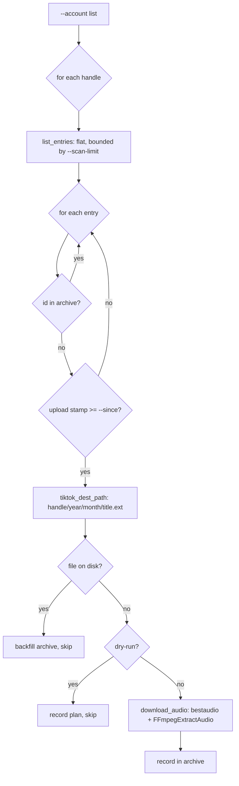

# TikTok Audio Downloader — Architecture & Code Walkthrough

A deep-dive into `transcription/tools/fetch_tiktok.py`: what it does, why it is
built the way it is, every design decision, and a line-by-line explanation of the
code. This is the third ingestion tool alongside
[`YOUTUBE_DOWNLOADER.md`](YOUTUBE_DOWNLOADER.md) and
[`INSTAGRAM_DOWNLOADER.md`](INSTAGRAM_DOWNLOADER.md).

---

## 1. What the tool does

Given one or more TikTok **account handles**, the tool:

1. Lists each profile's videos, **newest first**, bounded by `--scan-limit`.
2. Skips anything already downloaded — a **download archive** (source of truth)
   *and* an on-disk check (safety net).
3. Downloads the audio of the rest with ffmpeg.
4. Writes the result to:

   ```
   {out}/{account}/{year}/{month}/{title}.{ext}
   ```

   - `{account}` — the TikTok handle (`@` stripped, lowercased).
   - `{year}/{month}` — the video's **upload** month in UTC.
   - `{title}` — sanitized video description (first 150 chars), falling back to
     the upload timestamp when there is no description.
   - `{ext}` — audio codec, default `mp3`.

No login is required for **public** accounts. Private or geo-restricted accounts
can be reached by passing `--cookies-file` (a Netscape-format cookies file
exported from a browser logged into TikTok).

### Example commands

```bash
# all new videos from one account
python transcription/tools/fetch_tiktok.py --account @2mmaroc

# multiple accounts, bounded first run
python transcription/tools/fetch_tiktok.py \
    --account @2mmaroc --account @medi1tv \
    --max-downloads 10 --since 20260101

# preview without downloading
python transcription/tools/fetch_tiktok.py --account @2mmaroc --dry-run

# private account via cookies
python transcription/tools/fetch_tiktok.py \
    --account @privatechannel --cookies-file ~/tiktok-cookies.txt

# tee a timestamped log
python transcription/tools/fetch_tiktok.py \
    --account @2mmaroc --log tiktok/fetch.log
```

---

## 2. Where it fits

The HACA transcription pipeline consumes `{account}/{year}/{month}/…` audio trees.
`fetch_tiktok.py` is the third ingestion tool that fills this tree (alongside
YouTube and Instagram):

```
TikTok accounts ──► fetch_tiktok.py ──► tiktok/{handle}/{year}/{month}/{title}.mp3
YouTube channels ──► fetch_youtube.py ──► youtube/{channel}/{year}/{month}/{title}.mp3
Instagram accounts ──► fetch_instagram.py ──► instagram/{account}/{year}/{month}/{title}.mp3
                              │  all three import
                              ▼
                     tools/_media_common.py
                              │
                              ▼
                     transcription/cli.py → out/srt/…
```

---

## 3. Architecture

### 3.1 Compared to the YouTube tool

TikTok uses the **same yt-dlp engine** as YouTube, so the two tools share their
architecture very closely. The key differences:

| Aspect | YouTube (`fetch_youtube.py`) | TikTok (`fetch_tiktok.py`) |
|--------|------------------------------|---------------------------|
| Listing | Two-phase: flat list → per-video `extract_info` for metadata | **Single-phase**: flat listing already includes `timestamp`, `title`, `uploader` |
| JS runtime | Needs deno + `yt-dlp-ejs` | **Not needed** — TikTok uses no EJS challenge system |
| Auth | No login for public channels | No login for public accounts; `--cookies-file` for private |
| URL normalisation | Appends `/videos` to bare channel URLs | `account_url(handle)` builds `@handle` URL directly |
| Archive key | `youtube <video_id>` | `tiktok <video_id>` |
| Handle normalisation | Not needed | `normalize_handle` strips `@` and lowercases |

### 3.2 Single-phase listing — why no Phase 2?

The YouTube tool does two yt-dlp calls per unseen video: a cheap flat listing for
all IDs, then a full `extract_info` per video to get the upload timestamp and
channel title. TikTok's yt-dlp extractor already returns `timestamp`, `title`,
and `uploader` in the flat listing itself, so we can build the destination path
directly from the flat entry — **no per-video metadata call needed**. This makes
each unseen video cost exactly one yt-dlp call (the download), not two.

### 3.3 The processing pipeline



### 3.4 Pure core vs I/O

| Half | Symbols |
|------|---------|
| **Pure core** | `normalize_handle`, `account_url`, `stamp_from_entry`, `archive_key`, `title_from_entry`, `tiktok_dest_path`, `build_ydl_list_opts`, `build_ydl_audio_opts`, `entry_url`, `TikConfig`, `RunStats` |
| **I/O** | `list_entries`, `download_audio`, `download_account`, `download_all`, `main` |

`ydl_factory` is injected everywhere — the full orchestration loop is exercised
in tests with a `FakeTikTokYDL`, no network or ffmpeg required.

---

## 4. Library choices

- **`yt-dlp`** — same engine as the YouTube tool. The `tiktok:user` extractor
  lists a profile's videos newest-first via TikTok's `item_list` API. No JS
  runtime (`--js-runtimes`) or `yt-dlp-ejs` package is needed for TikTok.
- **`ffmpeg`** (system binary) — same as the other two tools.
- **`_media_common`** — shared helpers (`slugify_channel`, `sanitize_filename`,
  `stamp_from_datetime`, `dest_for`, `load_archive`, `append_archive`,
  `make_logger`, `DEFAULT_SCAN_LIMIT`). No new dependencies.

---

## 5. Line-by-line walkthrough

### 5.1 Imports

```python
from _media_common import (
    DEFAULT_SCAN_LIMIT, append_archive, dest_for, load_archive,
    make_logger, sanitize_filename, slugify_channel, stamp_from_datetime,
)
```

All shared helpers imported; `yt_dlp` is **not** imported at module level — only
lazily in `main()` so the module loads in tests without yt-dlp.

### 5.2 `normalize_handle`

```python
_HANDLE_RE = re.compile(r"^@?(?P<handle>[\w.\-]+)$")

def normalize_handle(raw: str) -> str:
    m = _HANDLE_RE.match(raw.strip())
    if not m:
        raise ValueError(f"invalid TikTok handle: {raw!r}")
    return m.group("handle").lower()
```

- Strips a leading `@` and lowercases: `"@2MMaroc"` → `"2mmaroc"`.
- Rejects obviously invalid input (spaces, slashes) with a clear `ValueError`,
  which `argparse`'s `_valid_handle` type turns into a usage error at parse time.
- Lowercasing is important: TikTok handles are case-insensitive but yt-dlp passes
  them to the API verbatim; lowercasing keeps archive keys consistent across
  different spellings of the same handle.

### 5.3 `account_url`

```python
def account_url(handle: str) -> str:
    return f"https://www.tiktok.com/@{handle}"
```

- Builds the canonical URL for yt-dlp's `tiktok:user` extractor.
- Unlike YouTube, no `/videos` suffix is needed — `@handle` maps directly to the
  uploads list.

### 5.4 `stamp_from_entry`

```python
def stamp_from_entry(entry: dict) -> str:
    ts = entry.get("timestamp")
    if ts is not None:
        return stamp_from_datetime(
            dt.datetime.fromtimestamp(int(ts), dt.timezone.utc)
        )
    upload_date = entry.get("upload_date")
    if upload_date and re.fullmatch(r"\d{8}", str(upload_date)):
        return f"{upload_date}000000"
    raise ValueError(...)
```

- Works **directly on the flat entry dict** (not on a full `extract_info` result),
  because TikTok's flat listing already includes `timestamp`.
- Identical logic to `stamp_from_info` in `fetch_youtube.py` but reads from an
  entry rather than a per-video info dict — the key architectural difference
  enabling single-phase listing.
- `stamp_from_datetime` (from `_media_common`) converts the epoch to UTC
  `YYYYMMDDHHMMSS`.
- Tests: `test_stamp_from_entry_prefers_timestamp`,
  `test_stamp_from_entry_falls_back_to_upload_date`,
  `test_stamp_from_entry_raises_without_either`.

### 5.5 `archive_key`

```python
def archive_key(entry: dict) -> str:
    extractor = (
        entry.get("ie_key") or entry.get("extractor_key")
        or entry.get("extractor") or "tiktok"
    )
    return f"{str(extractor).lower()} {entry.get('id')}"
```

- Produces `"tiktok <video_id>"` — the same yt-dlp archive-line format used
  across all three tools. Namespacing by platform means a single shared archive
  file can hold entries from all three without collision.

### 5.6 `title_from_entry` / `tiktok_dest_path`

```python
def title_from_entry(entry: dict, fallback_stamp: str) -> str:
    raw = entry.get("title") or entry.get("description")
    return sanitize_filename(raw, max_len=150, fallback=fallback_stamp)
```

- TikTok's yt-dlp info dict uses `title` (truncated description, already
  available in the flat listing). `sanitize_filename` strips illegal filesystem
  characters and applies the 150-char cap from `_media_common`.
- Falls back to the `stamp` (computed just before calling this) so title-less
  videos still get a stable, unique name.

```python
def tiktok_dest_path(out_root, account, entry, ext):
    stamp = stamp_from_entry(entry)
    title = title_from_entry(entry, stamp)
    return dest_for(out_root, account, stamp, title, ext)
```

- Composes the full path using `dest_for` from `_media_common`:
  `out/{account}/{YYYY}/{MM}/{title}.{ext}`.

### 5.7 `build_ydl_list_opts` / `build_ydl_audio_opts`

```python
def build_ydl_list_opts(playlistend=None, cookies_file=None):
    opts = {"quiet": True, "noprogress": True,
            "extract_flat": "in_playlist", "skip_download": True}
    if playlistend is not None:
        opts["playlistend"] = playlistend
    if cookies_file:
        opts["cookiefile"] = str(cookies_file)
    return opts
```

- `extract_flat="in_playlist"` + `skip_download=True` → cheap listing, no
  downloads. `playlistend` bounds how many of the newest videos yt-dlp fetches.
- `cookiefile` is forwarded when `--cookies-file` is given, enabling access to
  private/geo-restricted accounts.

```python
def build_ydl_audio_opts(dest_dir, filename_stem, audio_format, cookies_file=None):
    opts = {
        "quiet": True, "noprogress": True,
        "paths": {"home": str(dest_dir)},
        "outtmpl": {"default": f"{filename_stem.replace('%', '%%')}.%(ext)s"},
        "format": "bestaudio/best",
        "postprocessors": [{"key": "FFmpegExtractAudio",
                            "preferredcodec": audio_format,
                            "preferredquality": "0"}],
    }
    if cookies_file:
        opts["cookiefile"] = str(cookies_file)
    return opts
```

- Same structure as the YouTube tool's `build_ydl_opts`. `paths.home` is literal
  (not template-expanded) so exotic handle names can't break the `outtmpl`. Any
  `%` in the title is escaped to `%%`.

### 5.8 `TikConfig`

```python
@dataclass
class TikConfig:
    accounts: List[str]      # normalised handles (no @)
    out: Path = Path("tiktok")
    audio_format: str = "mp3"
    max_downloads: Optional[int] = None
    scan_limit: int = DEFAULT_SCAN_LIMIT
    since: Optional[str] = None
    dry_run: bool = False
    cookies_file: Optional[Path] = None

    @property
    def archive_path(self): return self.out / ".download-archive.txt"

    def listing_end(self):
        if self.scan_limit and self.scan_limit > 0:
            end = self.scan_limit
            if self.max_downloads:
                end = max(end, self.max_downloads)
            return end
        return None
```

- One typed record for all run knobs. `listing_end()` implements the same
  "never drop below `--max-downloads`; 0 = unbounded" logic as in the YouTube and
  Instagram tools.
- Tests: `test_tikconfig_listing_end_*` (3 cases).

### 5.9 `entry_url`

```python
def entry_url(entry: dict) -> str:
    vid = entry.get("id")
    uploader = entry.get("uploader") or entry.get("channel_id") or "user"
    if vid:
        return f"https://www.tiktok.com/@{uploader}/video/{vid}"
    return entry.get("url") or entry.get("webpage_url") or ""
```

- Builds a `/@uploader/video/<id>` watch URL from a flat entry. TikTok requires
  both the uploader and the video ID in the URL, unlike YouTube's `watch?v=<id>`.
  The `uploader` is available in the flat entry so no extra API call is needed.

### 5.10 `list_entries`

```python
def list_entries(handle, ydl_factory, playlistend=None, cookies_file=None):
    opts = build_ydl_list_opts(playlistend=playlistend, cookies_file=cookies_file)
    with ydl_factory(opts) as ydl:
        info = ydl.extract_info(account_url(handle), download=False)
    return list(info.get("entries") or [])
```

- **Phase 1 only** — the result is a bounded list of flat entries, each already
  containing `timestamp`, `title`, and `uploader`. No Phase 2 needed.
- `ydl_factory` is injected (real `YoutubeDL` in production, `FakeTikTokYDL` in
  tests).

### 5.11 `download_audio`

```python
def download_audio(video_url, dest, audio_format, ydl_factory, cookies_file=None):
    dest.parent.mkdir(parents=True, exist_ok=True)
    ext = audio_format.lstrip(".")
    stem = dest.name[: -(len(ext) + 1)]
    opts = build_ydl_audio_opts(dest.parent, stem, audio_format, cookies_file)
    with ydl_factory(opts) as ydl:
        ydl.download([video_url])
```

- Takes the full `dest` path and recovers the stem by stripping the `.{ext}`
  suffix — single source of truth for the filename (the path already computed by
  `tiktok_dest_path`).

### 5.12 `download_account` — the orchestration loop

```python
def download_account(handle, cfg, ydl_factory, *, log=print):
    stats = RunStats()
    archive_ids = load_archive(cfg.archive_path)
    end = cfg.listing_end()
    log(f"[{handle}] listing videos (scanning {end if end is not None else 'all'} most recent)...")
    entries = list_entries(handle, ydl_factory, playlistend=end, cookies_file=cfg.cookies_file)
    total = len(entries)
    log(f"[{handle}] examining {total} video(s)")
    for idx, entry in enumerate(entries, start=1):
        pos = f"[{handle} {idx}/{total}]"
        if cfg.max_downloads is not None and stats.downloaded >= cfg.max_downloads:
            ...break
        key = archive_key(entry)
        if key in archive_ids:
            stats.skipped_archive += 1; continue
        try:
            stamp = stamp_from_entry(entry)
        except Exception as exc:
            stats.errors += 1; log(...); continue
        if cfg.since and stamp[:8] < cfg.since:
            stats.skipped_old += 1; continue
        dest = tiktok_dest_path(cfg.out, handle, entry, cfg.audio_format)
        if dest.exists():
            append_archive(cfg.archive_path, key); archive_ids.add(key)
            stats.skipped_disk += 1; continue
        title = title_from_entry(entry, stamp)
        if cfg.dry_run:
            stats.planned.append((title, dest)); log(f"  {pos} [plan] ..."); continue
        log(f"  {pos} [..] downloading {title}")
        try:
            download_audio(entry_url(entry), dest, cfg.audio_format, ydl_factory, cfg.cookies_file)
        except Exception as exc:
            stats.errors += 1; log(...); continue
        append_archive(cfg.archive_path, key); archive_ids.add(key)
        stats.downloaded += 1; log(f"  {pos} [ok] {dest}")
    return stats
```

Step by step — same pattern as the other tools:
- `listing_end()` bounds the scan; listing feedback lines prevent confusion.
- **`--max-downloads` cap** — counts downloads, not all examined entries.
- **Archive check** (dedup #1, O(1)) — skip immediately with no download.
- **`stamp_from_entry` in-loop** — failures are isolated per-video.
- **`--since` filter** — lexicographic `YYYYMMDD` comparison.
- **On-disk check** (dedup #2) — backfill + skip if file exists.
- **Dry-run** — record plan, write nothing.
- **Download** — isolated per-video error, loop continues on failure.
- On success — append to archive (file + in-memory set), tally, log `[ok]`.

Tests: `test_download_account_downloads_new`, `..._skips_archived`,
`..._backfills_on_disk`, `..._idempotent`, `..._max_downloads`,
`..._since_filter`, `..._dry_run`, `..._error_isolation`.

### 5.13 `download_all` / `main`

```python
def download_all(cfg, ydl_factory, *, log=print):
    total = RunStats()
    for handle in cfg.accounts:
        try:
            stats = download_account(handle, cfg, ydl_factory, log=log)
        except Exception as exc:
            total.errors += 1; log(f"[{handle}] [error] {exc}"); continue
        total.add(stats)
    return total
```

- Per-account error isolation (e.g. private/banned account) so the rest still run.

`main()`:
- Lazy `from yt_dlp import YoutubeDL` → friendly exit 2 if missing.
- Requires at least one `--account`; otherwise exits 2 immediately.
- Builds `TikConfig`, calls `download_all`, prints summary.

---

## 6. Testing

```bash
.venv/bin/python -m pytest transcription/tests/test_fetch_tiktok.py -q
# 38 passed
```

### FakeTikTokYDL

A class-level `entries` list + `downloaded` list. `extract_info` returns
`{"entries": entries}`; `download` appends to `downloaded` and writes a dummy
`.mp3` file so `dest.exists()` checks work. A `BrokenYDL` subclass raises
`RuntimeError` on `download` to exercise error isolation.

### Coverage

| Group | Tests |
|-------|-------|
| `normalize_handle` | 4 (parametrized + garbage rejection) |
| `account_url` | 1 |
| `stamp_from_entry` | 3 (timestamp, upload_date, missing) |
| `archive_key` | 2 |
| `title_from_entry`, `tiktok_dest_path` | 4 |
| `entry_url` | 2 |
| `build_ydl_list_opts`, `build_ydl_audio_opts` | 4 |
| `TikConfig` | 4 (`listing_end`, `archive_path`) |
| `download_account` loop | 8 (new/archived/disk/idempotent/max/since/dry/error) |
| `download_all` | 1 |
| Parser | 4 |

---

## 7. Operational notes

### 7.1 Install

```bash
pip install -r transcription/tools/requirements-tiktok.txt   # just yt-dlp
sudo apt install ffmpeg
```

No JS runtime or `yt-dlp-ejs` needed — TikTok uses no EJS challenge system.

### 7.2 Private / geo-restricted accounts

Export cookies from your browser while logged into TikTok (the "Get cookies.txt
LOCALLY" browser extension outputs Netscape format) and pass the file:

```bash
python transcription/tools/fetch_tiktok.py \
    --account @privatechannel --cookies-file ~/tiktok-cookies.txt
```

The cookies file path is passed directly to yt-dlp as `cookiefile`.

### 7.3 Rate limits

TikTok's API can throttle rapid repeated requests. Keep `--scan-limit` modest for
scheduled runs (the default 50 is a reasonable daily window for most creators).

### 7.4 Scheduling (cron)

```cron
0 5 * * * cd /home/martcm/Desktop/Dev/Stages/HACA && \
  .venv/bin/python transcription/tools/fetch_tiktok.py \
  --account @2mmaroc --account @medi1tv >> tiktok/fetch.log 2>&1
```

### 7.5 Exit codes

| Code | Meaning |
|------|---------|
| `0` | Success (including "nothing new"). |
| `1` | Fatal error during the run. |
| `2` | yt-dlp not installed, or no `--account` given. |
