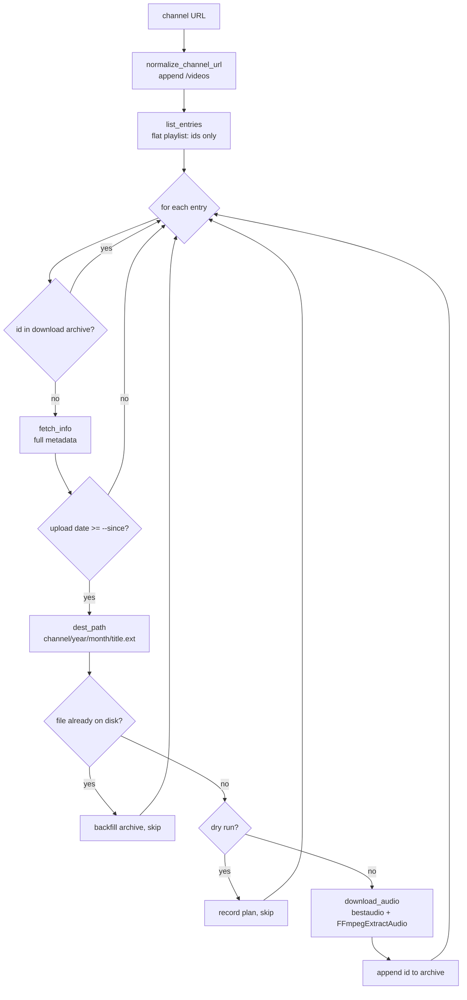

# YouTube Channel Audio Downloader — Architecture & Code Walkthrough

A deep-dive into `transcription/tools/fetch_youtube.py`: what it does, why it is
built the way it is, every library choice, and a line-by-line explanation of the
code. This is the companion document to the tool itself.

---

## 1. What the tool does

Given a **YouTube channel URL**, the tool:

1. Lists every upload on the channel.
2. Skips anything it has already downloaded.
3. Downloads the **audio** of the rest.
4. Stores each file at:

   ```
   {out}/{channel}/{year}/{month}/{video_title}.{ext}
   ```

   - `{out}` — output root, default `./youtube`.
   - `{channel}` — derived from the channel **title** (sanitized for the filesystem).
   - `{year}/{month}` — the video's **upload** year and month (not the date it was
     downloaded), e.g. `2026/03`.
   - `{video_title}` — the sanitized video title (illegal characters stripped,
     length-capped; non-Latin letters and emoji preserved).
   - `{ext}` — the audio codec extension (`mp3` by default).

   The upload timestamp is still computed internally (as the 14-digit
   `YYYYMMDDHHMMSS` stamp used elsewhere in this repo) and is used as the
   filename **fallback** when a video has no usable title.

It is **incremental**: run it on a schedule and each run only grabs videos that
appeared since the last run. "Already downloaded" is tracked two ways at once —
a yt-dlp-style **download archive** (the source of truth) *and* a **filesystem
check** (a safety net), per the design decision recorded for this project.

### Example commands

```bash
# every new video since the last run
python transcription/tools/fetch_youtube.py --url https://www.youtube.com/@SomeChannel

# bound a big first run: only the 5 most recent, only from 2026 on
python transcription/tools/fetch_youtube.py --url https://www.youtube.com/@SomeChannel \
    --max-downloads 5 --since 20260101

# preview only — touch nothing
python transcription/tools/fetch_youtube.py --url https://www.youtube.com/@SomeChannel --dry-run

# different codec / output location
python transcription/tools/fetch_youtube.py --url ... --audio-format m4a --out /data/youtube

# pick the JavaScript runtime yt-dlp uses for extraction (default: deno)
python transcription/tools/fetch_youtube.py --url ... --js-runtimes node

# also append timestamped output to a log file
python transcription/tools/fetch_youtube.py --url ... --log youtube/fetch.log
```

---

## 2. Where it fits in the HACA project

This repo is a Darija transcription pipeline. Media is organised as
`medias/{channel}/{year}/{month}/{day}/{stamp}.{ext}` and consumed by the
transcription CLI (`transcription/cli.py` → `core/`). There is already an
`organize_medias.py` tool that reshuffles a flat tree into that layout using the
**14-digit `YYYYMMDDHHMMSS` filename stamp**.

This downloader is the **ingestion stage** that sits *in front of* transcription:
it pulls raw audio off YouTube. Per the project decision, it writes to a separate
`youtube/` tree (not `medias/`) for now, using a
`{channel}/{year}/{month}/{title}` layout. It still computes the same 14-digit
`YYYYMMDDHHMMSS` upload stamp internally (used for the year/month folders and as
the filename fallback), so the output stays compatible with the rest of the
tooling.

```
YouTube channel ──► fetch_youtube.py ──► youtube/{channel}/{year}/{month}/{title}.mp3
                                              │
                                              ▼
                              (future) organize / transcribe pipeline
```

---

## 3. Architecture

### 3.1 Design principles

The module is split into two halves:

| Half | Functions | Property |
|------|-----------|----------|
| **Pure core** | `slugify_channel`, `sanitize_filename`, `stamp_from_info`, `dest_path`, `normalize_channel_url`, `archive_key`, `entry_url`, `load_archive`, `append_archive`, `parse_js_runtimes`, `build_ydl_opts` | No network, no global state. Deterministic. Fully unit-tested. |
| **Orchestration / I/O** | `list_entries`, `fetch_info`, `download_audio`, `download_new`, `main` | Talk to yt-dlp and the filesystem. Tested with a fake yt-dlp. |

The key architectural decision is **dependency injection of yt-dlp**. Every
function that needs yt-dlp receives a `ydl_factory` callable instead of importing
and constructing `YoutubeDL` directly. In production `main()` passes a factory
that builds a real `YoutubeDL`; in tests we pass a `FakeYDL` class. This is what
lets us test the entire download loop — dedup logic, path decisions, archive
backfill, error counting — **without a network connection or ffmpeg**.

### 3.2 The processing pipeline



### 3.3 Why two-phase extraction (flat list → per-video info)?

Listing a channel with full metadata for every video is slow and heavy. So:

- **Phase 1 — `list_entries`** uses `extract_flat="in_playlist"`. yt-dlp returns
  just the video ids/titles, cheaply, and **bounded to the newest `--scan-limit`
  uploads** (`playlistend`) so a giant channel doesn't take minutes to list. This
  is enough to check the archive and skip already-seen videos **without** a
  per-video network hit.
- **Phase 2 — `fetch_info`** is only called for videos that survived the archive
  check, to learn the precise upload timestamp and channel title needed to build
  the path.

This keeps repeat runs fast: on a channel you already follow, almost every entry
is rejected at the cheap Phase-1 archive check.

### 3.4 Deduplication strategy (archive + filesystem)

Two independent mechanisms, by design:

1. **Download archive** (`youtube/.download-archive.txt`) — the source of truth.
   One line per downloaded video, in yt-dlp's own format `youtube <videoid>`.
   Checked first (Phase 1), so it is both correct and fast.
2. **Filesystem safety net** — even if the archive is missing/incomplete (e.g.
   you deleted it, or copied files in by hand), before downloading we check
   whether the destination file already exists. If it does, we **backfill** the
   archive and skip. This means the archive self-heals and we never re-download a
   file we already have.

The archive format deliberately mirrors yt-dlp's `--download-archive` so the file
stays interchangeable with yt-dlp's own tooling.

### 3.5 Idempotency

Running the tool twice in a row downloads nothing the second time
(`test_download_new_idempotent_second_run` proves this). `--dry-run` writes
nothing at all — not even the archive (`test_download_new_dry_run`).

---

## 4. Library choices

### 4.1 `yt-dlp` (the one third-party dependency)

- **What it is:** the actively-maintained fork of youtube-dl. It handles the
  hard, ever-changing parts: resolving channel URLs to upload lists, signature
  deciphering, format selection, and post-download audio extraction.
- **Why not the YouTube Data API?** The official API needs an API key, has daily
  quotas, and does not give you the media stream — you would still need something
  like yt-dlp to actually download. yt-dlp needs no key and does everything.
- **Why the Python API (`from yt_dlp import YoutubeDL`) instead of shelling out
  to the `yt-dlp` binary?** Two reasons:
  1. We get structured `info` dicts back (timestamp, channel title, id) directly
     as Python objects — no parsing stdout.
  2. It is trivially mockable for tests via dependency injection.
- **Two features we lean on:**
  - `extract_flat` for the cheap channel listing.
  - the `FFmpegExtractAudio` postprocessor for audio extraction.
- **Pinning:** `yt-dlp>=2025.1.1` in `requirements-youtube.txt`. yt-dlp ships
  frequent releases to keep up with YouTube changes, so we pin a recent baseline
  but allow forward updates rather than freezing an exact version that will rot.

### 4.2 `ffmpeg` (system dependency, not pip)

yt-dlp downloads the best audio stream, but converting/extracting it to a clean
`.mp3`/`.m4a` is done by **ffmpeg**, invoked by yt-dlp's `FFmpegExtractAudio`
postprocessor. ffmpeg is a native binary, not a Python package, so it is
installed via the OS (`apt install ffmpeg`, `brew install ffmpeg`, etc.) and must
be on `PATH`. This matches the rest of the repo, which already depends on ffmpeg
for media decoding (see `text.txt` notes on torchcodec/FFmpeg).

### 4.3 Standard library only for everything else

| Module | Used for |
|--------|----------|
| `argparse` | The CLI. Matches the style of `organize_medias.py`. |
| `dataclasses` | `FetchConfig` / `RunStats` — concise, typed records. |
| `datetime` | Converting the Unix `timestamp` to a UTC `YYYYMMDDHHMMSS` stamp. |
| `re` | Filename sanitisation, URL/date validation. |
| `pathlib.Path` | All path building (OS-independent, matches repo convention). |
| `typing` | Type hints for readability and tooling. |

No `requests`, no extra HTTP client — yt-dlp owns all networking.

---

## 5. Line-by-line walkthrough

The file is `transcription/tools/fetch_youtube.py`. We go top to bottom.

### 5.1 Shebang and module docstring

```python
#!/usr/bin/env python3
"""
Incrementally download the audio of every *new* video from a YouTube channel.
...
"""
```

- The shebang lets the script be run directly (`./fetch_youtube.py`) using the
  environment's Python 3.
- The module docstring is **reused as the CLI's `--help` description** later
  (via `description=__doc__`), so it documents the layout, examples, and
  dependencies in one place.

### 5.2 Imports

```python
from __future__ import annotations

import argparse
import datetime as dt
import re
import sys
from dataclasses import dataclass, field
from pathlib import Path
from typing import Callable, Iterable, List, Optional, Tuple
```

- `from __future__ import annotations` makes all type hints lazy strings, so we
  can annotate freely without import-order or runtime cost. (Matches the rest of
  the repo, e.g. `core/config.py`.)
- `datetime as dt` — aliased to keep timestamp code short.
- `Callable` is the type of the injected `ydl_factory`; the rest are ordinary
  hint helpers.
- Note: **`yt_dlp` is *not* imported at module top.** It is imported lazily
  inside `main()` so that importing this module (e.g. in tests) never requires
  yt-dlp to be installed.

### 5.3 Module-level regexes

```python
_ILLEGAL_FS = re.compile(r'[\\/:*?"<>|\x00-\x1f]')
```

- Matches characters illegal in filenames on common filesystems (Windows is the
  strictest): backslash, slash, colon, asterisk, question mark, double-quote,
  angle brackets, pipe, and ASCII control chars `\x00`–`\x1f`.
- Compiled once at import for efficiency. The leading `_` marks it private.

```python
_CHANNEL_ROOT = re.compile(
    r"youtube\.com/(@[^/]+|channel/[^/]+|c/[^/]+|user/[^/]+)$", re.IGNORECASE
)
```

- Matches a **bare** channel URL whose path ends right after the channel
  identifier — the four URL shapes YouTube uses: `/@handle`, `/channel/UC...`,
  `/c/Name`, `/user/Name`.
- The `$` anchor means it only matches when there is **no** trailing tab like
  `/videos` or `/streams`. `re.IGNORECASE` tolerates case variations.

### 5.4 `slugify_channel`

```python
def slugify_channel(title: Optional[str], fallback: str = "unknown-channel") -> str:
    if not title:
        return fallback
    cleaned = _ILLEGAL_FS.sub("", title)
    cleaned = re.sub(r"\s+", " ", cleaned).strip()
    cleaned = cleaned.strip(". ")
    return cleaned or fallback
```

- **Purpose:** turn a channel *title* into one safe path segment.
- `if not title:` handles both `None` and `""` → returns the fallback.
- `_ILLEGAL_FS.sub("", title)` deletes every illegal character. A title like
  `HACA / قناة` loses the `/`, leaving `HACA  قناة` (two spaces).
- `re.sub(r"\s+", " ", cleaned).strip()` collapses any run of whitespace to a
  single space and trims the ends → `HACA قناة`. Non-Latin letters (Arabic) are
  preserved, so titles stay readable.
- `cleaned.strip(". ")` removes leading/trailing dots and spaces — a trailing dot
  is invalid in a Windows folder name (`trailing dots...` → `trailing dots`).
- `return cleaned or fallback` — if sanitisation emptied the string (e.g. title
  was `///`), fall back to `unknown-channel`.
- **Tests:** `test_slugify_channel` (parametrized), `..._collapses_internal_whitespace`.

### 5.5 `stamp_from_info`

```python
def stamp_from_info(info: dict) -> str:
    ts = info.get("timestamp")
    if ts is not None:
        return dt.datetime.fromtimestamp(int(ts), dt.timezone.utc).strftime(
            "%Y%m%d%H%M%S"
        )
    upload_date = info.get("upload_date")
    if upload_date and re.fullmatch(r"\d{8}", str(upload_date)):
        return f"{upload_date}000000"
    raise ValueError(
        "info dict has neither a usable 'timestamp' nor an 8-digit 'upload_date'"
    )
```

- **Purpose:** produce the 14-digit `YYYYMMDDHHMMSS` stamp.
- **Preferred path:** yt-dlp's `timestamp` is a Unix epoch (seconds, UTC). We
  build a timezone-aware UTC datetime with `dt.datetime.fromtimestamp(ts,
  dt.timezone.utc)` — passing the explicit UTC tz means the result does **not**
  depend on the machine's local timezone, so the stamp is reproducible anywhere.
  `strftime("%Y%m%d%H%M%S")` formats it. Example: epoch `1781706600` →
  `20260617143000` (2026-06-17 14:30:00 UTC).
- **Fallback path:** if there is no `timestamp`, YouTube still gives a date-only
  `upload_date` like `20260617`. We validate it is exactly 8 digits with
  `re.fullmatch(r"\d{8}", ...)` and pad the time with `000000`.
- **Failure:** with neither field we raise `ValueError`; the caller in
  `download_new` catches this and counts it as a per-video error instead of
  crashing the whole run.
- **Tests:** `test_stamp_prefers_timestamp_utc`, `..._falls_back_to_upload_date`,
  `..._timestamp_wins_over_upload_date`, `..._raises_without_either`,
  `..._rejects_malformed_upload_date`.

### 5.6 `month_from_stamp` and `dest_path`
### 5.6 `sanitize_filename` and `dest_path`

```python
def sanitize_filename(name: Optional[str], max_len: int = 150, fallback: str = "video") -> str:
    if not name:
        return fallback
    cleaned = _ILLEGAL_FS.sub("", name)
    cleaned = re.sub(r"\s+", " ", cleaned).strip().strip(". ")
    if len(cleaned) > max_len:
        cleaned = cleaned[:max_len].rstrip(". ")
    return cleaned or fallback
```

- **Purpose:** turn a video *title* into a safe filename stem. Same illegal-char
  and whitespace handling as `slugify_channel` (it reuses `_ILLEGAL_FS`), with two
  additions:
  - a `max_len` cap (default 150) with a trailing `.`/space trim after slicing,
    so we stay comfortably under the 255-byte filesystem limit even for very long
    titles;
  - a `fallback` (default `"video"`) returned when the title is missing or
    sanitises away to nothing.
- Non-Latin letters and emoji survive — an Arabic or French title stays readable
  (verified on a real channel: `القيادة تحت المجهر| ...` → the `|` is dropped, the
  Arabic is kept).
- **Tests:** `test_sanitize_filename` (parametrized), `..._truncates`,
  `..._custom_fallback`.

```python
def dest_path(out_root: Path, channel: str, info: dict, ext: str) -> Path:
    stamp = stamp_from_info(info)
    year, month = stamp[:4], stamp[4:6]
    title = sanitize_filename(info.get("title"), fallback=stamp)
    return Path(out_root) / channel / year / month / f"{title}.{ext.lstrip('.')}"
```

- Builds `out/{channel}/{year}/{month}/{title}.{ext}`. The `year` and `month` are
  sliced from the upload stamp; the filename is the sanitized title.
- The stamp doubles as the **title fallback** (`fallback=stamp`), so a title-less
  video still gets a unique, meaningful filename.
- `ext.lstrip('.')` tolerates `"mp3"` or `".mp3"`.
- **Collision caveat:** because the filename is the title (not the unique stamp),
  two *different* videos on the same channel with the *same* title in the *same*
  month would map to the same path. The id-based download archive still prevents
  re-downloading the *same* video, but such a (rare) title clash would be treated
  by the on-disk safety net as "already have it" and skipped. If a channel is
  prone to duplicate titles, switch the filename back to the stamp (or prefix the
  title with it).
- **Tests:** `test_dest_path_layout_uses_title`,
  `test_dest_path_falls_back_to_stamp_without_title`,
  `test_dest_path_strips_dotted_ext_and_sanitizes_title`.

### 5.7 `normalize_channel_url`

```python
def normalize_channel_url(url: str) -> str:
    trimmed = url.rstrip("/")
    if _CHANNEL_ROOT.search(trimmed):
        return trimmed + "/videos"
    return url
```

- **Purpose:** make sure we list the channel's **uploads**, not its multi-tab
  home page. A bare channel URL given to yt-dlp returns a nested set of tabs;
  appending `/videos` targets the uploads list directly.
- `url.rstrip("/")` first removes a trailing slash so `@Chan/` and `@Chan` are
  treated the same.
- If `_CHANNEL_ROOT` matches (a bare channel URL), append `/videos`. Otherwise
  (already a tab, a playlist, or a single video) return the URL unchanged.
- **Tests:** `test_normalize_channel_url` (parametrized over all four channel
  shapes plus already-tabbed and single-video URLs).

### 5.8 `archive_key` and `entry_url`

```python
def archive_key(entry: dict) -> str:
    extractor = (
        entry.get("ie_key") or entry.get("extractor_key") or entry.get("extractor") or "youtube"
    )
    return f"{str(extractor).lower()} {entry.get('id')}"
```

- Builds the archive line for a video: `"<extractor> <id>"`, e.g.
  `youtube dQw4w9WgXcQ`.
- The `or` chain tries the several field names different yt-dlp versions use for
  the extractor, finally defaulting to `"youtube"`. `.lower()` matches yt-dlp's
  own archive casing, keeping the file interchangeable with yt-dlp.
- **Tests:** `test_archive_key_format`, `test_archive_key_defaults_extractor`.

```python
def entry_url(entry: dict) -> str:
    vid = entry.get("id")
    if vid:
        return f"https://www.youtube.com/watch?v={vid}"
    return entry.get("url") or ""
```

- Turns a flat-list entry into a watch URL for Phase-2 extraction. Preferring an
  id-built `watch?v=` URL is robust; if there is no id we fall back to whatever
  `url` the flat extractor supplied.
- **Tests:** `test_entry_url_from_id`, `test_entry_url_fallback`.

### 5.9 `load_archive` and `append_archive`

```python
def load_archive(archive_path: Path) -> set:
    if not archive_path.exists():
        return set()
    lines = archive_path.read_text(encoding="utf-8").splitlines()
    return {ln.strip() for ln in lines if ln.strip()}
```

- Reads the archive into a `set` for O(1) membership tests in the main loop.
- A missing file is not an error — it just means "nothing downloaded yet" → empty
  set. Blank lines are ignored.

```python
def append_archive(archive_path: Path, key: str) -> None:
    archive_path.parent.mkdir(parents=True, exist_ok=True)
    with archive_path.open("a", encoding="utf-8") as fh:
        fh.write(key + "\n")
```

- Appends a single line. `mkdir(parents=True, exist_ok=True)` ensures the output
  directory exists before the first write. Append mode (`"a"`) means we never
  rewrite the whole file — cheap and crash-safe.
- **Tests:** `test_load_archive_missing`, `test_append_then_load_archive`.

### 5.10 `build_ydl_opts`
First, `parse_js_runtimes` (a pure helper that feeds this one):

```python
def parse_js_runtimes(values: Optional[Iterable[str]]) -> Optional[dict]:
    values = list(values or [])
    if not values:
        return None
    return {
        runtime.lower(): {"path": path}
        for runtime, path in ([*arg.split(":", 1), None][:2] for arg in values)
    }
```

- Converts the CLI's `RUNTIME[:PATH]` strings into the **dict** shape yt-dlp's
  Python API expects for its `js_runtimes` option: `{'node': {'path': None}}`,
  `{'deno': {'path': '/opt/deno'}}`. The `[*arg.split(":", 1), None][:2]` trick
  yields exactly two values (runtime, path-or-`None`) whether or not a `:PATH`
  was given. This mirrors yt-dlp's own CLI parsing (`yt_dlp/__init__.py`).
- Returns `None` for empty input, so we never override yt-dlp's built-in default
  runtime (`deno`).
- **Tests:** `test_parse_js_runtimes_*`.

```python
def build_ydl_opts(
    dest_dir: Path, filename_stem: str, audio_format: str, js_runtimes: Optional[dict] = None
) -> dict:
    opts = {
        "quiet": True,
        "noprogress": True,
        "paths": {"home": str(dest_dir)},
        "outtmpl": {"default": f"{filename_stem.replace('%', '%%')}.%(ext)s"},
        "format": "bestaudio/best",
        "postprocessors": [
            {
                "key": "FFmpegExtractAudio",
                "preferredcodec": audio_format,
                "preferredquality": "0",
            }
        ],
    }
    if js_runtimes:
        opts["js_runtimes"] = js_runtimes
    return opts
```

This dict is exactly the options yt-dlp needs to download one video's audio:

- `"quiet"` / `"noprogress"` — suppress yt-dlp's own chatter; we print our own
  summary.
- `"paths": {"home": str(dest_dir)}` — sets the output **directory**. Importantly,
  `home` is treated **literally** by yt-dlp, *not* run through template
  expansion. That is why we put the (possibly exotic) channel-title folder here:
  a `%` or other special char in the channel name can't break a template.
- `"outtmpl": {"default": f"{filename_stem.replace('%', '%%')}.%(ext)s"}` — the
  **filename** template, now the sanitized video title rather than the stamp.
  Because the title is user content, any literal `%` is escaped to `%%` so yt-dlp
  doesn't mistake it for a template field like `%(title)s`. `%(ext)s` is filled
  by yt-dlp with the final extension after extraction.
- `"format": "bestaudio/best"` — download the best audio-only stream, or fall
  back to the best combined stream if no audio-only one exists.
- `"postprocessors"` — run `FFmpegExtractAudio` to transcode to `audio_format`
  (e.g. `mp3`). `preferredquality: "0"` requests best VBR quality for lossy
  codecs.
- `if js_runtimes:` — only add the key when the user requested a runtime;
  otherwise the key is absent and yt-dlp uses its default.
- **Tests:** `test_build_ydl_opts`, `..._escapes_percent_in_title`,
  `..._includes_js_runtimes`.

### 5.11 `FetchConfig`

```python
@dataclass
class FetchConfig:
    url: str
    out: Path = Path("youtube")
    audio_format: str = "mp3"
    max_downloads: Optional[int] = None
    since: Optional[str] = None
    dry_run: bool = False
    js_runtimes: Optional[dict] = None
    scan_limit: int = DEFAULT_SCAN_LIMIT

    @property
    def archive_path(self) -> Path:
        return self.out / ".download-archive.txt"

    def listing_end(self) -> Optional[int]:
        if self.scan_limit and self.scan_limit > 0:
            end = self.scan_limit
            if self.max_downloads:
                end = max(end, self.max_downloads)
            return end
        return None  # unbounded
```

- A single typed record holding every knob for a run, so functions take one
  `cfg` argument rather than a long parameter list (same pattern as the repo's
  `TranscribeConfig`).
- Defaults encode the project decisions: output to `youtube/`, `mp3`, no caps,
  and a `scan_limit` of `DEFAULT_SCAN_LIMIT` (50) so huge channels don't hang.
- `archive_path` is a derived **property** — the archive always lives at the
  output root as a hidden file, so it travels with the downloads.
- `listing_end()` decides how many of the newest uploads to fetch: the
  `scan_limit` window, but never smaller than `max_downloads`; `scan_limit == 0`
  means "no bound" (returns `None`).

### 5.12 `RunStats`

```python
@dataclass
class RunStats:
    downloaded: int = 0
    skipped_archive: int = 0
    skipped_disk: int = 0
    skipped_old: int = 0
    errors: int = 0
    planned: List[Tuple[str, Path]] = field(default_factory=list)

    def summary(self) -> str:
        return (
            f"downloaded={self.downloaded} | skipped(archive)={self.skipped_archive} | "
            f"skipped(on-disk)={self.skipped_disk} | skipped(too-old)={self.skipped_old} | "
            f"errors={self.errors}"
        )
```

- Tallies every outcome so the run can print one honest summary line.
- `planned` collects `(title, dest)` pairs for `--dry-run`. It uses
  `field(default_factory=list)` because mutable defaults must not be shared across
  instances — the standard dataclass idiom.
- Each counter maps to one branch of the main loop (see below).

### 5.13 `list_entries`, `fetch_info`, `download_audio`

```python
def list_entries(channel_url, ydl_factory, js_runtimes=None, playlistend=None) -> List[dict]:
    opts = {
        "quiet": True,
        "noprogress": True,
        "extract_flat": "in_playlist",
        "skip_download": True,
    }
    if js_runtimes:
        opts["js_runtimes"] = js_runtimes
    if playlistend is not None:
        opts["playlistend"] = playlistend
    with ydl_factory(opts) as ydl:
        info = ydl.extract_info(normalize_channel_url(channel_url), download=False)
    return list(info.get("entries") or [])
```

- **Phase 1.** `extract_flat="in_playlist"` tells yt-dlp to return lightweight
  entries (ids/titles) for the channel's uploads without fetching each video —
  fast. `skip_download` + `download=False` guarantee nothing is fetched.
- `playlistend` (from `cfg.listing_end()`) bounds how many of the newest uploads
  yt-dlp pages through. **This is the fix for huge channels**: without it,
  `list(info["entries"])` would force yt-dlp to enumerate the entire channel
  before the loop's `--max-downloads` could apply, which looks like a hang.
- `ydl_factory(opts)` constructs the (real or fake) yt-dlp as a context manager.
- `info.get("entries") or []` guards against a `None` entries field; `list(...)`
  materialises the (now bounded) list.
- The optional `js_runtimes` is forwarded so even listing uses the chosen JS
  runtime.
- **Tests:** `test_list_entries_passes_playlistend`.

```python
def fetch_info(video_url: str, ydl_factory: Callable, js_runtimes: Optional[dict] = None) -> dict:
    opts = {"quiet": True, "noprogress": True, "skip_download": True}
    if js_runtimes:
        opts["js_runtimes"] = js_runtimes
    with ydl_factory(opts) as ydl:
        return ydl.extract_info(video_url, download=False)
```

- **Phase 2.** Full metadata for a single video (so we get `timestamp`,
  `channel`, and `title`). Still no download.

```python
def download_audio(
    video_url: str,
    dest: Path,
    audio_format: str,
    ydl_factory: Callable,
    js_runtimes: Optional[dict] = None,
) -> None:
    dest.parent.mkdir(parents=True, exist_ok=True)
    ext = audio_format.lstrip(".")
    stem = dest.name[: -(len(ext) + 1)]  # strip the trailing ".{ext}"
    opts = build_ydl_opts(dest.parent, stem, audio_format, js_runtimes)
    with ydl_factory(opts) as ydl:
        ydl.download([video_url])
```

- The only function that actually pulls bytes. It now takes the **full
  destination path** (`dest`) computed by `dest_path`, so the file yt-dlp writes
  matches the title-based path exactly.
- It recovers the filename **stem** by stripping the known `.{ext}` suffix from
  `dest.name`, then passes it to `build_ydl_opts` (which re-escapes any `%`).
  This keeps a single source of truth for the filename — the path already
  computed by the caller.
- `js_runtimes` is forwarded to the download options too.

### 5.14 `download_new` — the orchestrator

```python
def download_new(
    cfg: FetchConfig,
    ydl_factory: Callable,
    *,
    log: Callable[[str], None] = print,
) -> RunStats:
    stats = RunStats()
    archive_ids = load_archive(cfg.archive_path)
```

- The heart of the tool. `ydl_factory` is injected (real in prod, fake in tests).
  `log` is injectable too so tests can silence output (`log=lambda m: None`); it
  defaults to `print`. The `*` makes `log` keyword-only.
- Load the archive once into a set; we keep it updated in memory as we go.

```python
    end = cfg.listing_end()
    log(f"listing uploads (scanning {end if end is not None else 'all'} most recent)...")
    entries = list_entries(cfg.url, ydl_factory, cfg.js_runtimes, end)
    total = len(entries)
    log(f"examining {total} upload(s)")
    for idx, entry in enumerate(entries, start=1):
        pos = f"[{idx}/{total}]"
        if cfg.max_downloads is not None and stats.downloaded >= cfg.max_downloads:
            log(f"reached --max-downloads={cfg.max_downloads}, stopping")
            break
```

- Fetch the **bounded** upload list (`cfg.listing_end()` → `playlistend`), print
  feedback before/after the listing so a slow list doesn't look like a hang, then
  iterate with a 1-based index. `pos` (`[i/total]`) prefixes the per-video lines.
- Before doing work, honour `--max-downloads`: once we've downloaded the cap,
  stop. (The check counts *downloads*, so skipped videos don't consume the
  budget.)

```python
        key = archive_key(entry)
        if key in archive_ids:
            stats.skipped_archive += 1
            continue
```

- **Dedup mechanism #1 (cheap, Phase 1):** if the id is already in the archive,
  skip immediately — no per-video network call. This is what makes repeat runs
  fast.

```python
        try:
            info = fetch_info(entry_url(entry), ydl_factory, cfg.js_runtimes)
            stamp = stamp_from_info(info)
        except Exception as exc:  # noqa: BLE001
            stats.errors += 1
            log(f"  [error] {entry.get('id')}: {exc}")
            continue
```

- Only now (for unseen videos) do we pay for full metadata. A failure here — a
  private/removed video, a missing timestamp — is **isolated**: we count it and
  move on, so one bad video never aborts the whole run. (`# noqa: BLE001`
  acknowledges the deliberate broad except.)

```python
        if cfg.since and stamp[:8] < cfg.since:
            stats.skipped_old += 1
            continue
```

- Apply the optional `--since` lower bound by comparing the `YYYYMMDD` prefix of
  the stamp lexicographically (valid because the format is zero-padded fixed
  width).

```python
        channel = slugify_channel(info.get("channel") or info.get("uploader"))
        dest = dest_path(cfg.out, channel, info, cfg.audio_format)
```

- Derive the channel folder from the title (`channel`, falling back to
  `uploader`) and compute the destination path.

```python
        if dest.exists():
            append_archive(cfg.archive_path, key)
            archive_ids.add(key)
            stats.skipped_disk += 1
            continue
```

- **Dedup mechanism #2 (filesystem safety net):** the file is already on disk but
  the archive didn't know (archive deleted, files copied in manually, etc.). We
  **backfill** the archive and skip — the archive self-heals.

```python
        if cfg.dry_run:
            title = info.get("title") or entry.get("id")
            stats.planned.append((title, dest))
            log(f"  [plan] {title} -> {dest}")
            continue
```

- In dry-run mode we record and print the plan but download nothing and write
  nothing (not even the archive).

```python
        try:
            download_audio(
                entry_url(entry), dest, cfg.audio_format, ydl_factory, cfg.js_runtimes
            )
        except Exception as exc:  # noqa: BLE001
            stats.errors += 1
            log(f"  [error] downloading {entry.get('id')}: {exc}")
            continue
```

- The real download, again with isolated error handling (e.g. ffmpeg missing, or
  a network blip) so the run continues with the next video.

```python
        append_archive(cfg.archive_path, key)
        archive_ids.add(key)
        stats.downloaded += 1
        log(f"  [ok] {dest}")

    return stats
```

- On success, record the id in the archive (both on disk and in our in-memory
  set) and count it. After the loop, hand back the stats.
- **Tests:** `test_download_new_downloads_all_new`, `..._skips_archived`,
  `..._backfills_when_file_exists`, `..._idempotent_second_run`,
  `..._respects_max_downloads`, `..._since_filter`, `..._dry_run`,
  `..._counts_errors`.

### 5.15 CLI: `_valid_since`, `build_parser`, `main`
### 5.15 CLI: `_valid_since`, `make_logger`, `build_parser`, `main`

```python
def _valid_since(value: str) -> str:
    if not re.fullmatch(r"\d{8}", value):
        raise argparse.ArgumentTypeError("--since must be YYYYMMDD, e.g. 20260101")
    return value
```

- An argparse "type" function: rejects a malformed `--since` at parse time with a
  friendly message instead of failing deep in the loop.

```python
def make_logger(log_path: Optional[Path]):
    fh = None
    if log_path is not None:
        log_path.parent.mkdir(parents=True, exist_ok=True)
        fh = log_path.open("a", encoding="utf-8")

    def emit(msg: str) -> None:
        print(msg)
        if fh is not None:
            ts = dt.datetime.now().strftime("%Y-%m-%d %H:%M:%S")
            fh.write(f"{ts} {msg}\n")
            fh.flush()

    def close() -> None:
        if fh is not None:
            fh.close()

    return emit, close
```

- Builds the **tee** used for all of the tool's own output. `emit(msg)` always
  `print`s to stdout (clean, no timestamp) and, when `--log` was given, *also*
  appends a timestamped copy to the file. `flush()` after every line means a
  `tail -f` on the log shows progress live and nothing is lost if the process is
  killed.
- Returns `(emit, close)`; `close()` is a no-op when there's no log file, so
  `main` can always call it. This `emit` is what gets passed as `download_new`'s
  injectable `log`, so the `[i/N]` per-video lines land in the file too.
- **Scope:** the tee captures the tool's *own* lines (header, per-video
  `[i/N] [..]`/`[ok]`/`[plan]`/`[error]`, summary). yt-dlp's own warnings go to
  stderr and are **not** in the file — for a full transcript, also redirect the
  shell (`>> file 2>&1`).
- **Tests:** `test_make_logger_writes_timestamped_file`, `..._appends`,
  `..._none_is_noop`.

```python
def build_parser() -> argparse.ArgumentParser:
    p = argparse.ArgumentParser(
        description=__doc__, formatter_class=argparse.RawDescriptionHelpFormatter
    )
    p.add_argument("--url", required=True, help="YouTube channel URL.")
    p.add_argument("--out", type=Path, default=Path("youtube"), ...)
    p.add_argument("--audio-format", default="mp3", ...)
    p.add_argument("--max-downloads", type=int, default=None, ...)
    p.add_argument("--scan-limit", type=int, default=DEFAULT_SCAN_LIMIT, ...)
    p.add_argument("--since", type=_valid_since, default=None, ...)
    p.add_argument("--dry-run", action="store_true", ...)
    p.add_argument("--js-runtimes", action="append", metavar="RUNTIME[:PATH]", ...)
    p.add_argument("--log", type=Path, default=None, metavar="FILE", ...)
    return p
```

- Builds the CLI. `description=__doc__` reuses the module docstring;
  `RawDescriptionHelpFormatter` preserves its formatting (matches
  `organize_medias.py`).
- `--url` is required; `--out` is parsed straight into a `Path`; `--since` runs
  through the validator; `--dry-run` is a boolean flag.
- Factoring this into its own function makes the parser unit-testable without
  invoking `main` — see the `test_parser_*` tests.

```python
def main(argv: Optional[Iterable[str]] = None) -> int:
    args = build_parser().parse_args(list(argv) if argv is not None else None)
```

- `argv` defaults to `None` so argparse reads `sys.argv`, but tests can pass an
  explicit list. Returns an `int` exit code.

```python
    try:
        from yt_dlp import YoutubeDL
    except ImportError:
        print(
            "error: yt-dlp is not installed.\n"
            "  pip install -r transcription/tools/requirements-youtube.txt",
            file=sys.stderr,
        )
        return 2
```

- **Lazy import** of yt-dlp. If it isn't installed, the user gets a clear
  one-line fix and exit code `2` — *not* a traceback. This is why the module can
  be imported in tests without yt-dlp present.

```python
    def ydl_factory(opts: dict):
        return YoutubeDL(opts)

    cfg = FetchConfig(
        url=args.url, out=args.out, audio_format=args.audio_format,
        max_downloads=args.max_downloads, since=args.since, dry_run=args.dry_run,
        js_runtimes=parse_js_runtimes(args.js_runtimes),
    )
```

- The production factory closes over the real `YoutubeDL`. The parsed args are
  packed into a `FetchConfig`; `--js-runtimes` strings are converted to yt-dlp's
  dict form by `parse_js_runtimes`.

```python
    emit, close_log = make_logger(args.log)
    emit(f"channel: {cfg.url}")
    emit(f"output : {cfg.out}  (archive: {cfg.archive_path})")
    if cfg.dry_run:
        emit("mode   : DRY RUN (no downloads)")

    try:
        stats = download_new(cfg, ydl_factory, log=emit)
    except Exception as exc:  # noqa: BLE001
        print(f"error: {exc}", file=sys.stderr)
        close_log()
        return 1

    emit("\n" + stats.summary())
    close_log()
    return 0
```

- Build the tee logger, print a short header, run the orchestrator (passing
  `emit` as its `log`), and on a **fatal** error (something outside the per-video
  try/except, e.g. an invalid channel URL that fails the initial listing) surface
  a clean message with exit code `1`. The log file is closed on every path.
  Otherwise print the summary and exit `0`.

```python
if __name__ == "__main__":
    raise SystemExit(main())
```

- Standard entry point: run `main()` and use its return value as the process exit
  code. (Same idiom as `organize_medias.py`.)

---

## 6. Testing

Tests live in `transcription/tests/test_fetch_youtube.py` (42 tests). Run them:

```bash
.venv/bin/python -m pytest transcription/tests/test_fetch_youtube.py -q
# 42 passed
```

### 6.1 How the network is avoided

The test file defines a `FakeYDL` class that mimics the slice of the
`yt_dlp.YoutubeDL` API we use:

- It is a context manager (`__enter__`/`__exit__`).
- `extract_info` returns a canned flat listing when `extract_flat` is set,
  otherwise a per-video info dict from a class-level `info_map`.
- `download` records the URL and **writes a dummy file** at the templated path,
  so `dest.exists()` behaves like a real download afterwards.

A `fake_ydl` fixture resets its class-level state between tests. Passing this
class as the `ydl_factory` exercises the **entire** `download_new` loop with no
network and no ffmpeg — covering archive skips, filesystem backfill, idempotency,
`--max-downloads`, `--since`, dry-run, and error counting.

### 6.2 What each test group covers

| Group | Functions under test |
|-------|----------------------|
| `test_slugify_channel*` | `slugify_channel` (illegal chars, whitespace, unicode, empties) |
| `test_stamp*` | `stamp_from_info` (timestamp vs upload_date, UTC, failures) |
| `test_month_from_stamp`, `test_dest_path*` | path building |
| `test_normalize_channel_url` | URL `/videos` normalisation |
| `test_archive_key*`, `test_entry_url*` | archive line + watch URL helpers |
| `test_load_archive*`, `test_append_then_load_archive` | archive I/O |
| `test_build_ydl_opts` | yt-dlp option dict |
| `test_download_new_*` | the full orchestration loop via `FakeYDL` |
| `test_parser_*` | CLI argument parsing & validation |

> **Implementation note:** during development the epoch `1781706600` was
> initially assumed to be 2026-06-13; running the tests revealed it is actually
> **2026-06-17 14:30:00 UTC**. The code was correct; the test expectations were
> fixed to match. This is exactly the kind of off-by-a-few-days error the UTC
> stamp test is meant to catch.

---

## 7. Operational notes

### 7.1 Install

```bash
pip install -r transcription/tools/requirements-youtube.txt
# plus a system ffmpeg:
sudo apt install ffmpeg     # Debian/Ubuntu
```

### 7.1b JavaScript runtime (recommended)

Recent yt-dlp needs a JavaScript runtime to solve YouTube's signature/`nsig`
challenges. Without one you'll see a `No supported JavaScript runtime could be
found` warning; extraction may still work but can fail or miss formats, and
runtime-less extraction is **deprecated**. yt-dlp auto-detects **deno** (its
default), so the smoothest fix is to install deno and pass nothing:

```bash
curl -fsSL https://deno.land/install.sh | sh   # then add ~/.deno/bin to PATH
```

To use a different runtime, pass `--js-runtimes`:

```bash
python transcription/tools/fetch_youtube.py --url <CHANNEL> --js-runtimes node
python transcription/tools/fetch_youtube.py --url <CHANNEL> --js-runtimes deno:/opt/deno
```

> Note: with some runtimes (e.g. `node`) this yt-dlp version may additionally ask
> for `--remote-components ejs:github` to fetch its challenge-solver script.
> `deno` avoids that extra step, which is why it's the recommended choice. Also
> keep yt-dlp current (`pip install -U yt-dlp`) — stale versions are the usual
> cause of extraction breakage.

### 7.2 Big channels and the `--scan-limit` window

Each run first asks yt-dlp for the channel's upload list. On a huge channel
(e.g. a TV network with tens of thousands of videos) fetching the *entire* list
can take many minutes and look like the tool is hung. To prevent that, the tool
only examines the channel's **most-recent `--scan-limit` uploads** (default
`50`); this is passed to yt-dlp as `playlistend`, so it stops paging early.

```bash
# default: examine the 50 newest uploads
python transcription/tools/fetch_youtube.py --url <CHANNEL>

# bound a first run to a handful
python transcription/tools/fetch_youtube.py --url <CHANNEL> --max-downloads 20

# only from a date onward
python transcription/tools/fetch_youtube.py --url <CHANNEL> --since 20260101

# widen / narrow the scan window; 0 = scan everything (slow on big channels)
python transcription/tools/fetch_youtube.py --url <CHANNEL> --scan-limit 200
```

Notes:
- `--scan-limit` is never allowed to drop below `--max-downloads`, so a large
  explicit cap still works.
- Because the window only covers the newest N uploads, if a channel posts more
  than `--scan-limit` videos between two of your runs, the oldest of those would
  fall outside the window. For regular runs the default is plenty; raise
  `--scan-limit` (or use `--since`) if you let a busy channel sit for a long time.
- While listing, the tool prints `listing uploads (scanning N most recent)...`
  then `examining N upload(s)` so you can see it working rather than guessing.

After the first run, scheduled runs are incremental and cheap.

### 7.3 Scheduling (cron example)

```cron
# every day at 03:00, grab anything new
0 3 * * * cd /home/martcm/Desktop/Dev/Stages/HACA && \
  .venv/bin/python transcription/tools/fetch_youtube.py \
  --url https://www.youtube.com/@SomeChannel >> youtube/fetch.log 2>&1
```

### 7.4 The archive file

`youtube/.download-archive.txt` is the dedup source of truth. Keep it. If you
lose it, the filesystem safety net still prevents re-downloads of files you have,
and the archive rebuilds itself as it backfills. Its format matches yt-dlp's own
`--download-archive`, so you can point yt-dlp at the same file if needed.

### 7.4b Logs & progress

The tool prints its own status as it goes — a header, then one line per video
it acts on, then a final summary:

```
channel: https://www.youtube.com/@SomeChannel
output : youtube  (archive: youtube/.download-archive.txt)
  [1/3] [..] downloading Some Episode Title
  [1/3] [ok] youtube/Some Channel/2026/03/Some Episode Title.mp3
  ...
downloaded=1 | skipped(archive)=2 | skipped(on-disk)=0 | skipped(too-old)=0 | errors=0
```

- `[i/N]` is the position in the channel's upload list, so you always know how
  far through you are.
- `[..] downloading <title>` is printed **before** a download starts and `[ok]`
  **after** it finishes — so on a long video you see it begin rather than waiting
  in silence. (Videos skipped via the archive print nothing, to avoid noise on
  channels you already follow.)
- yt-dlp's own per-file **progress bar is intentionally suppressed**
  (`quiet`/`noprogress`) to keep the output clean; the `[i/N]`/`[..]`/`[ok]`
  lines are the progress signal instead.

For a persistent record, use `--log FILE`: every line above is also appended to
the file with a `YYYY-MM-DD HH:MM:SS` timestamp (and flushed immediately, so
`tail -f youtube/fetch.log` works live):

```bash
python transcription/tools/fetch_youtube.py --url <CHANNEL> --log youtube/fetch.log
```

`--log` captures the tool's own lines. To also capture yt-dlp's warnings (which
go to stderr), additionally redirect the shell: `... >> youtube/fetch.log 2>&1`.

### 7.5 Exit codes

| Code | Meaning |
|------|---------|
| `0` | Success (including "nothing new"). |
| `1` | Fatal error during the run (e.g. invalid channel URL). |
| `2` | yt-dlp not installed. |
